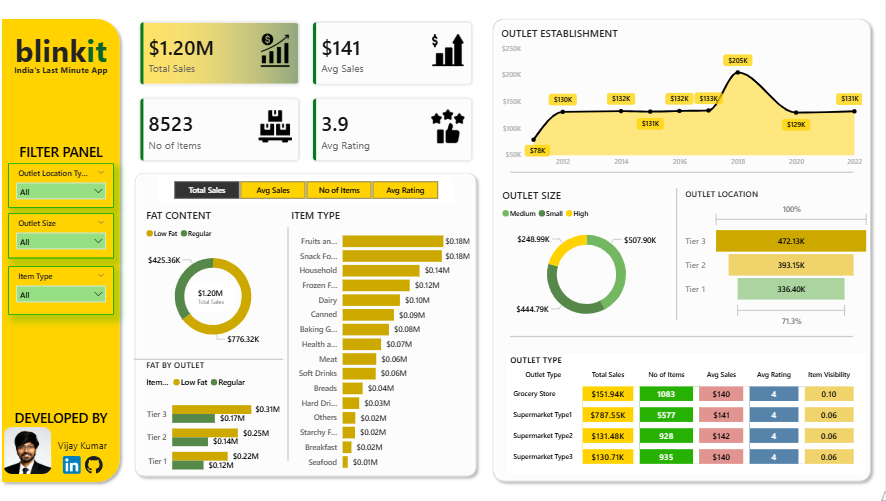

# Blinkit Sales Performance Analytics – Power BI

Executive-ready Power BI dashboard analyzing Blinkit sales performance across outlet types, locations, sizes, and item categories.

## Screenshots of Report Pages:

### Dashboard Page

### sales-by-location-item Page

## Key KPIs
- Total Sales: $1.20M
- Avg Sales: $141
- Items Sold: 8,523
- Avg Rating: 3.9

## Tools
Power BI, DAX, Power Query, Data Modeling

## 👤 Author

**Dev Dadhania**
Data Analytics | BI | Tableau | Power BI
Location: Hyderabad, India

Email: dev886621@gmail.com

If you find this useful, consider starring the repository.
